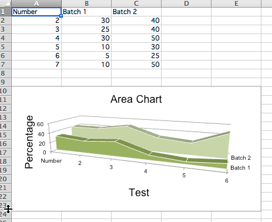

Area Charts
===========

2D Area Charts
--------------

Area charts are similar to line charts with the addition that the area underneath the plotted line is filled.
Different variants are available by setting the grouping to "standard", "stacked" or "percentStacked"; "standard" is the default.

.. literalinclude:: area.py

.. image:: area.png
   :alt: "Sample area charts"

3D Area Charts
--------------

You can also create 3D area charts

.. literalinclude:: area3d.py

This produces a simple 3D area chart where the third axis can be used to replace the legend:

