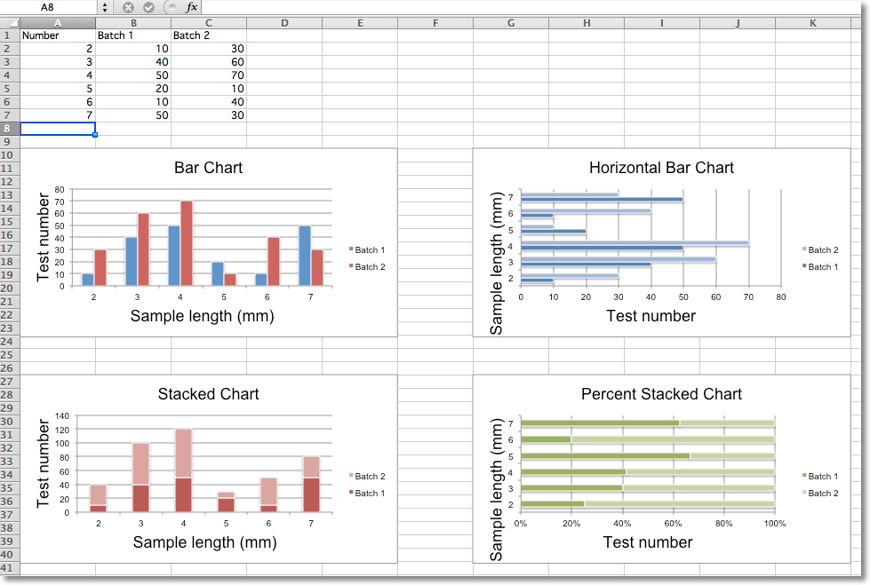
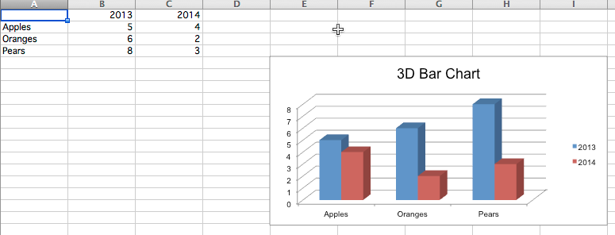

Bar and Column Charts
=====================

In bar charts values are plotted as either horizontal bars or vertical columns.

Vertical, Horizontal and Stacked Bar Charts
-------------------------------------------

.. note::

   The following settings affect the different chart types.

   Switch between vertical and horizontal bar charts by setting `type` to
   `col` or `bar` respectively.

   When using stacked charts the `overlap` needs to be set to 100.

   If bars are horizontal, x and y axes are reversed.

.. literalinclude:: bar.py

This will produce four charts illustrating the various possibilities.

3D Bar Charts
-------------

You can also create 3D bar charts

.. literalinclude:: bar3d.py

This produces a simple 3D bar chart

