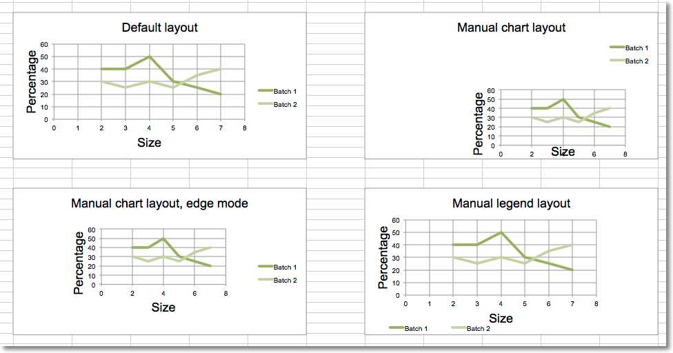

Changing the layout of plot area and legend
===========================================

The layout of the chart within the canvas can be set by using the layout
property of an instance of a layout class.

Chart layout
------------

Size and position
+++++++++++++++++

The chart can be positioned within its container. ``x`` and ``y`` adjust
position, ``w`` and ``h`` adjust the size . The units are proportions of the
container. A chart cannot be positioned outside of its container and the
width and height are the dominant constraints: if x + w > 1, then x = 1 - w.

| x is the horizontal position from the left
| y is the vertical position from the top
| h is the height of the chart relative to its container
| w is the width of the box

Mode
++++

In addition to the size and position, the mode for the relevant attribute can
also be set to either `factor` or `edge`. Factor is the default:

.. code::

  layout.xMode = edge

Target
++++++

The layoutTarget can be set to ``outer`` or ``inner``. The default is ``outer``:

.. code::

  layout.layoutTarget = inner

Legend layout
-------------

The position of the legend can be controlled either by setting its position:
``r``, ``l``, ``t``, ``b``, and ``tr``, for right, left, top, bottom and top
right respectively. The default is ``r``.

.. code::

  legend.position = 'tr'

or applying a manual layout:

.. code::

  legend.layout = ManualLayout()

.. literalinclude:: chart_layout.py

This produces four charts illustrating various possibilities:

