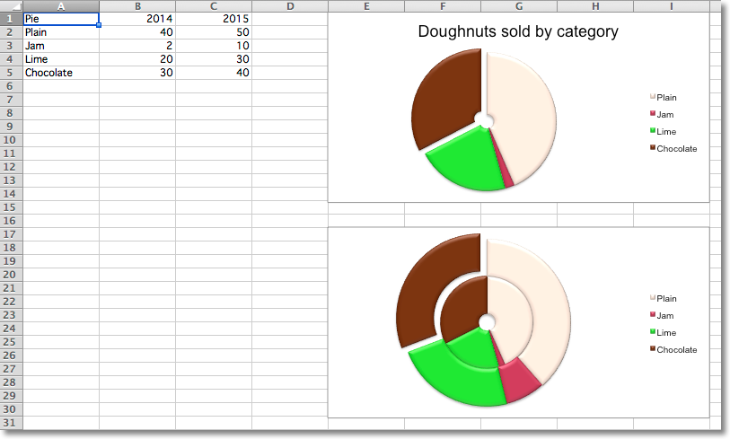

Doughnut Charts
---------------

Doughnut charts are similar to pie charts except that they use a ring instead
of a circle. They can also plot several series of data as concentric rings.

.. literalinclude:: doughnut.py

