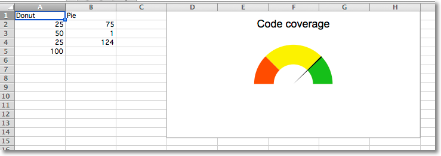

Gauge Charts
============

Gauge charts combine a pie chart and a doughnut chart to create a "gauge". The first chart is a doughnut chart with four slices. The first three slices correspond to the colours of the gauge; the fourth slice, which is half of the doughnut, is made invisible.

A pie chart containing three slices is added. The first and third slice are invisible so that the second slice can act as the needle on the gauge.

The effects are done using the graphical properties of individual data points in a data series.

.. literalinclude:: gauge.py

