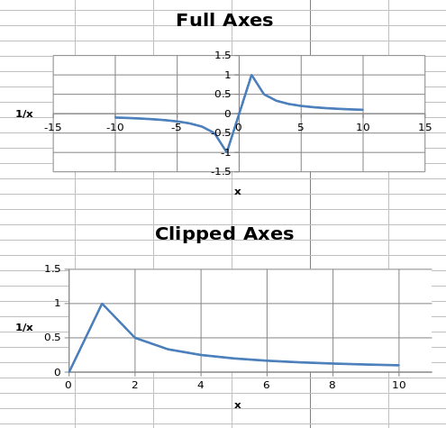
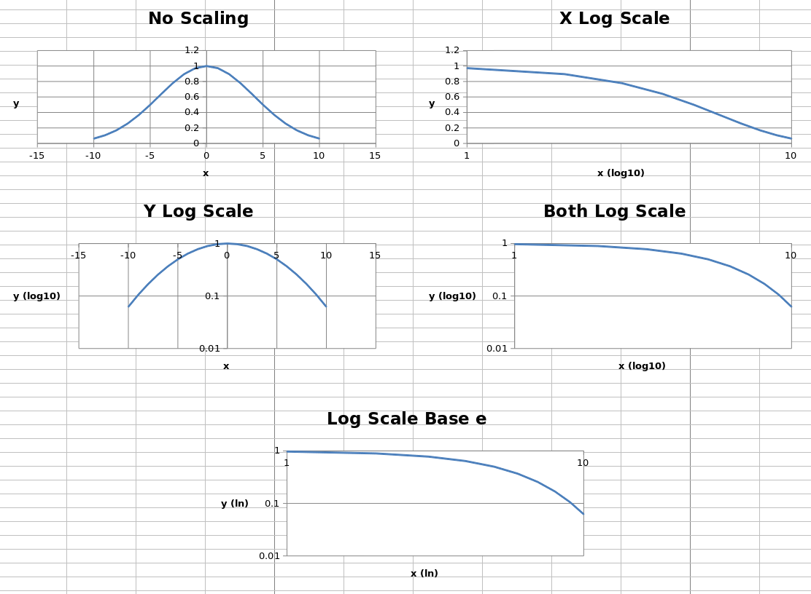
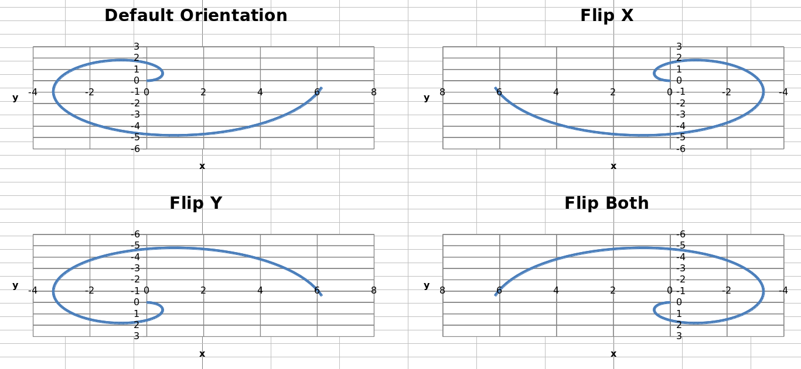

Axis Limits and Scale
=====================

Minima and Maxima
-----------------

Axis minimum and maximum values can be set manually to display specific regions
on a chart.

.. literalinclude:: limits_and_scaling_minmax.py

.. note::

    In some cases such as the one shown, setting the axis limits is effectively
    equivalent to displaying a sub-range of the data. For large datasets,
    rendering of scatter plots (and possibly others) will be much faster when
    using subsets of the data rather than axis limits in both Excel and
    Open/Libre Office.

Logarithmic Scaling
-------------------

Both the x- and y-axes can be scaled logarithmically. The base of the logarithm
can be set to any valid float. If the x-axis is scaled logarithmically, negative
values in the domain will be discarded.

.. literalinclude:: limits_and_scaling_log.py

This produces five charts that look something like this:

The first four charts show the same data unscaled, scaled logarithmically in
each axis and in both axes, with the logarithm base set to 10. The final chart
shows the same data with both axes scaled, but the base of the logarithm set to
``e``.

Axis Orientation
----------------

Axes can be displayed "normally" or in reverse. Axis orientation is controlled
by the scaling ``orientation`` property, which can have a value of either
``'minMax'`` for normal orientation or ``'maxMin'`` for reversed.

.. literalinclude:: limits_and_scaling_orientation.py

This produces four charts with the axes in each possible combination of
orientations that look something like this:

