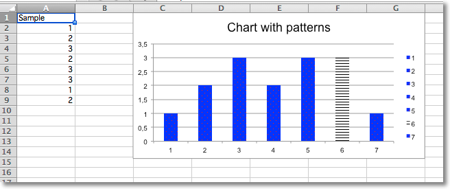

Adding Patterns
---------------

Whole data series and individual data points can be extensively styled through the `graphicalProperties`. Getting things just right may take some time.

.. literalinclude:: pattern.py

