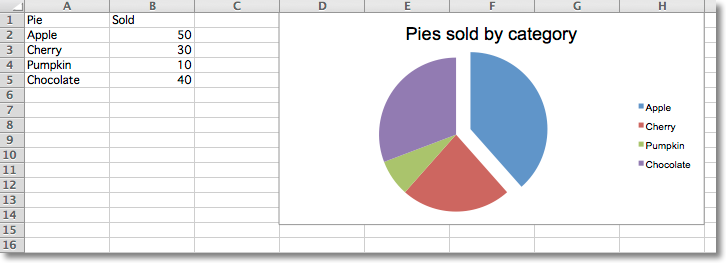
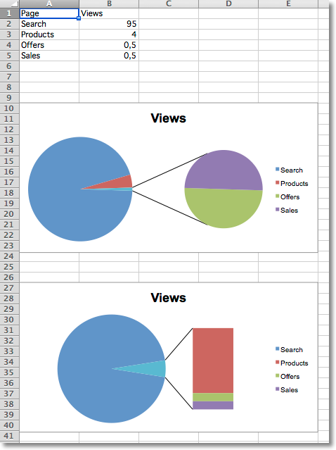
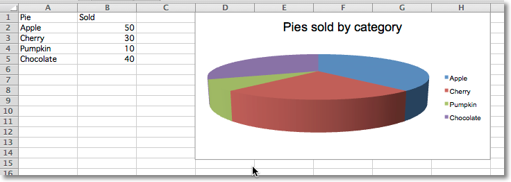
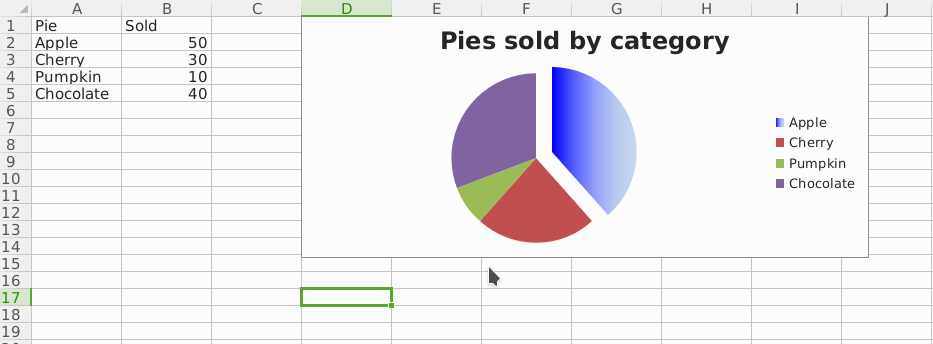

Pie Charts
==========

Pie Charts
----------

Pie charts plot data as slices of a circle with each slice representing the
percentage of the whole. Slices are plotted in a clockwise direction with 0°
being at the top of the circle. Pie charts can only take a single series of
data. The title of the chart will default to being the title of the series.

.. literalinclude:: pie.py

Projected Pie Charts
--------------------

Projected pie charts extract some slices from a pie chart and project them
into a second pie or bar chart. This is useful when there are several smaller
items in the data series. The chart can be split according to percent, val(ue)
or pos(ition). If nothing is set then the application decides which to use.
In addition custom splits can be defined.

3D Pie Charts
-------------

Pie charts can also be created with a 3D effect.

.. literalinclude:: pie3D.py

Gradient Pie Charts
-------------------

Pie charts can also be created with gradient series.

..literalinclude:: pie-gradient.py

