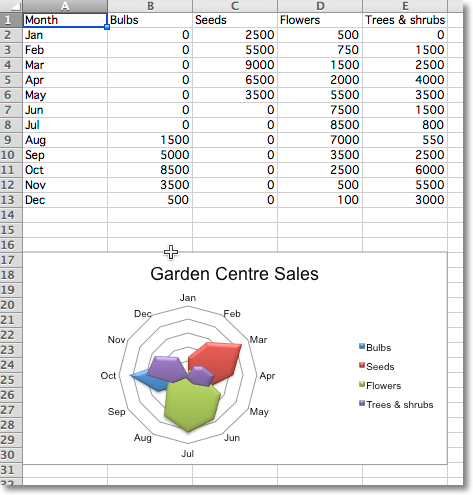

Radar Charts
------------

Data that is arranged in columns or rows on a worksheet can be plotted in a
radar chart. Radar charts compare the aggregate values of multiple data
series. It is effectively a projection of an area chart on a circular x-axis.

There are two types of radar chart: standard, where the area is marked with a
line; and filled, where the whole area is filled. The additional
type "marker" has no effect. If markers are desired these can be set for the
relevant series.

.. literalinclude:: radar.py

