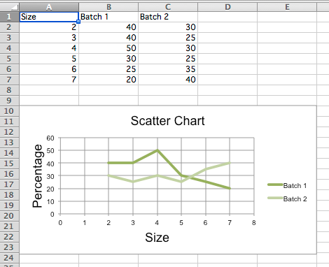

Scatter Charts
==============

Scatter, or xy, charts are similar to some line charts. The main difference
is that one series of values is plotted against another. This is useful where
values are unordered.

.. literalinclude:: scatter.py

.. Note::

   The specification says that there are the following types of scatter charts:
   'line', 'lineMarker', 'marker', 'smooth', 'smoothMarker'. However, at least
   in Microsoft Excel, this is just a shortcut for other settings that otherwise
   have no effect. For consistency with line charts, the style for each series 
   should be set manually.
