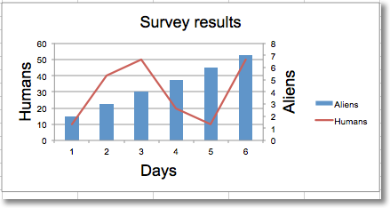

Adding a second axis
=====================

Adding a second axis actually involves creating a second chart that shares a
common x-axis with the first chart but has a separate y-axis.

.. literalinclude:: secondary.py

This produces a combined line and bar chart looking something like this:

