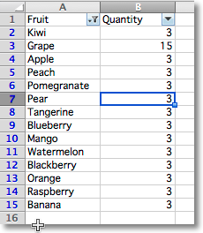

Using filters and sorts
=======================

It's possible to add a filter to a worksheet.

.. note::

  Filters and sorts can only be configured by openpyxl but will need to be applied in applications like Excel. This is because they actually rearranges or format cells or rows in the range.

To add a filter you define a range and then add columns and sort conditions:

.. literalinclude:: filters.py

This will add the relevant instructions to the file but will **neither actually filter nor sort**.

